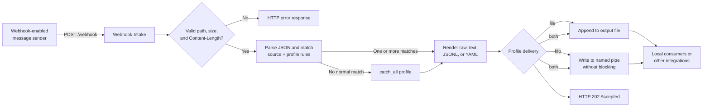

# Webhook Intake

[](https://github.com/wuilber002/webhook-intake/actions/workflows/tests.yml)
[](https://www.python.org/)
[](https://certbot.eff.org/)

Leia este documento em [Português](README.pt-BR.md).

A lightweight HTTP server that receives webhook messages and stores them locally. It does not cryptographically validate the sender; place it behind a trusted network or reverse proxy (or add authentication at the proxy) before exposing it to the Internet.

## Legal notice

This material is provided as is, without express or implied warranties, including warranties of fitness for a particular purpose, availability, security, continuity, or compatibility.

There is no commitment to support, service-level agreement, maintenance, or future development. Use, modification, and redistribution are entirely the user's responsibility and at the user's own risk.

Before any use, users are responsible for validating behavior, security, compliance, and operational suitability for their environment. Authors and contributors are not liable for losses, damages, service interruptions, incorrect configurations, or unintended impacts arising from use of this material.

## Requirements and startup

Python 3.11 or later is required. There are no external Python dependencies. OpenSSL is required only when generating a self-signed TLS certificate. Create a local configuration before starting:

```bash
cp config.ini.example config.ini
python3 webhook.py --config config.ini
```

The endpoint is `POST /webhook` and the health check is `GET /healthz`. The supplied [config.ini.example](config.ini.example) listens only on `127.0.0.1:1604` and writes to `./output/`. Copy it to `config.ini` and expose another address only behind a trusted firewall or reverse proxy.

### Requirements matrix

| Scenario | Required components | Network and privileges |
| --- | --- | --- |
| HTTP webhook or existing TLS certificate | Python 3.11+ | Allow the configured webhook port only when external senders need it. |
| Self-signed HTTPS | Python 3.11+, OpenSSL | No extra public port is required; clients must explicitly trust the certificate. |
| Public IP certificate through `--certbot-mode` | Python 3.11+, Certbot 5.4+ | Public static IP, inbound TCP/80 during validation, and permission to bind that port (usually root). |
| Automated IP-certificate renewal | Certbot renewal timer/hook | Restart the webhook after renewal so it reloads the certificate. |
| HTTP Basic Auth | Environment variable with the configured password | Use HTTPS for non-loopback exposure, or a trusted TLS proxy with loopback binding. |
| systemd service deployment | systemd, Python 3.11+ with `venv` support | Root access is needed only to install and manage the service. |

`certbot` and `openssl` are operating-system tools, not Python packages installed in this project's virtual environment. The script does not install either one automatically.

### Network connectivity prerequisites

Before exposing the receiver to external senders, confirm that every required path is allowed by both the operating-system firewall and the cloud/network firewall or security group:

| Flow | Protocol and port | When required |
| --- | --- | --- |
| Sender → webhook host | TCP/1604 by default, or the configured `port` | Required for external webhook delivery. Restrict source addresses whenever possible. |
| Certificate authority → webhook host | TCP/80 | Required only while Certbot standalone validates a public IP certificate. |
| Webhook host → certificate authority | Outbound TCP/443 | Required for Certbot certificate requests and renewal. |

For systems using firewalld, open the webhook port with `firewall-cmd --permanent --add-port=1604/tcp` followed by `firewall-cmd --reload`. Opening the host firewall alone is insufficient if an upstream firewall, router, load balancer, or cloud security group still blocks the path.

## Quick systemd setup

This is the shortest path to a public HTTPS receiver protected by Basic Auth. It requires a public static IP, inbound TCP/80 for Certbot validation and renewal, Python 3.11+ with `venv`, Git, and Certbot 5.4+.

```bash
sudo git clone https://github.com/wuilber002/webhook-intake.git /opt/webhook-intake
cd /opt/webhook-intake
sudo bash systemd/install.sh
sudo firewall-cmd --permanent --add-port=1604/tcp
sudo firewall-cmd --permanent --add-port=80/tcp
sudo firewall-cmd --reload
sudoedit /etc/webhook-intake/config.ini
```

Set `host = 0.0.0.0` in the configuration, then request the certificate. Replace the example IP and email:

```bash
sudo /opt/webhook-intake/.venv/bin/python /opt/webhook-intake/webhook.py \
  --config /etc/webhook-intake/config.ini --certbot-mode \
  --certbot-ip 198.51.100.10 --certbot-email admin@example.com
```

Create the password hash. This automatically enables Basic Auth in the INI file. The default username is `webhook`; to use another one, edit `basic_auth_username` in `/etc/webhook-intake/config.ini` before starting the service:

```bash
sudo -u whintake /opt/webhook-intake/.venv/bin/python \
  /opt/webhook-intake/webhook.py \
  --create-basic-auth-password-file /etc/webhook-intake/.faj383hfa
sudo systemctl enable --now webhook-intake.service
sudo systemctl enable --now webhook-intake-certbot-renew.timer
```

Test the receiver, replacing the IP, username, and password. Avoid placing a production password directly in shell history:

```bash
curl -i -u 'webhook:YOUR_PASSWORD' https://198.51.100.10:1604/webhook \
  -H 'Content-Type: application/json' \
  -d '{"title":"Webhook test","severity":"CRITICAL","body":"hello"}'
```

To print every delivery to the terminal, including the selected profile, run:

```bash
python3 webhook.py --config config.ini --debug
```

Host and port can also be overridden: `--host 0.0.0.0 --port 1604`.

## Running as a systemd service

For a long-running host, use the supplied [systemd deployment files](systemd/) rather than a Python daemon mode. `systemd` starts the process in the foreground, records its output in the journal, restarts it after an unexpected failure, and applies a restricted service account and filesystem access.

The installer uses this layout by default:

| Purpose | Default location |
| --- | --- |
| Application checkout and virtual environment | `/opt/webhook-intake` |
| Configuration, profiles, and TLS material | `/etc/webhook-intake` |
| Received output | `/var/lib/webhook-intake/output` |
| Service account | `whintake` |

Install the checkout under `/opt/webhook-intake`, then run the installer as root. It creates the service account and virtual environment, copies the initial configuration and shipped `.conf` profiles only when they do not yet exist, installs the units, and reloads systemd. It does not start the receiver or overwrite an existing configuration.

```bash
sudo git clone https://github.com/wuilber002/webhook-intake.git /opt/webhook-intake
cd /opt/webhook-intake
sudo bash ./systemd/install.sh
sudoedit /etc/webhook-intake/config.ini
sudo systemctl enable --now webhook-intake.service
```

Use `systemctl status webhook-intake.service` to inspect its state and `journalctl -u webhook-intake.service -f` to follow its logs. Set `debug = true` in `/etc/webhook-intake/config.ini` when temporary delivery diagnostics are needed; the debug output is recorded in the journal.

The service unit intentionally permits writes only to `/var/lib/webhook-intake`. Provision TLS files before starting it: place an existing certificate and private key under `/etc/webhook-intake/tls/`, owned by `whintake`, with the private key mode set to `0600`. For a self-signed certificate, enable TLS and `tls_self_signed = true`, run the command below once, stop it with `Ctrl+C` after the certificate is created, set `tls_self_signed = false`, and then start the service:

```bash
sudo -u whintake /opt/webhook-intake/.venv/bin/python \
  /opt/webhook-intake/webhook.py --config /etc/webhook-intake/config.ini
```

For Basic Auth in a systemd installation, create the password hash as the service account. The command enables Basic Auth in `/etc/webhook-intake/config.ini`; its default username is `webhook`. To change it, set `basic_auth_username = another-name` in that file before restarting the service:

```bash
sudo -u whintake /opt/webhook-intake/.venv/bin/python \
  /opt/webhook-intake/webhook.py \
  --create-basic-auth-password-file /etc/webhook-intake/.faj383hfa
sudo systemctl restart webhook-intake.service
```

The system configuration template already points `basic_auth_password_file` at that file. This avoids placing a password in the systemd unit or its environment.

### Certbot renewal with systemd

After a successful IP-certificate request, enable the supplied timer. It runs Certbot daily with a randomized delay. When a certificate is renewed, its deploy hook copies the replacement files to `/etc/webhook-intake/tls/` with the service account ownership and restarts the receiver. Confirm the `certbot` executable is `/usr/bin/certbot` or update [the renewal unit](systemd/webhook-intake-certbot-renew.service) before installing it.

```bash
sudo /opt/webhook-intake/.venv/bin/python /opt/webhook-intake/webhook.py \
  --config /etc/webhook-intake/config.ini --certbot-mode \
  --certbot-ip 198.51.100.10 --certbot-email admin@example.com
sudo systemctl enable --now webhook-intake-certbot-renew.timer
systemctl list-timers webhook-intake-certbot-renew.timer
```

Certbot standalone temporarily needs TCP/80, so stop any other process using that port and keep it reachable during validation. Start or restart `webhook-intake.service` after the first certificate is issued.

## HTTPS

Direct HTTPS is optional. Enable it in the local `config.ini` and provide an existing certificate and key:

```ini
tls_enabled = true
tls_cert_file = /etc/webhook-intake/fullchain.pem
tls_key_file = /etc/webhook-intake/privkey.pem
```

The server then listens at `https://host:port/webhook` and requires TLS 1.2 or later. Keep private-key paths outside the repository.

For development or a controlled internal environment, the script can create its own certificate on first startup:

```ini
tls_enabled = true
tls_self_signed = true
tls_cert_file = ./tls/webhook-intake.crt
tls_key_file = ./tls/webhook-intake.key
tls_self_signed_common_name = localhost
tls_self_signed_days = 365
```

Self-signed certificates require [OpenSSL](https://www.openssl.org/) and are not trusted by clients by default. For a local test, use `curl -k https://127.0.0.1:1604/webhook ...`; do not use `-k` in production. For public services, use a certificate issued by a trusted authority or terminate TLS at a trusted reverse proxy.

## Optional HTTP Basic Auth

Basic Auth protects `POST /webhook`; `GET /healthz` remains unauthenticated for local monitoring. It is disabled by default. Enable it in the local `config.ini`:

```ini
basic_auth_enabled = true
basic_auth_username = webhook
basic_auth_password_env = WEBHOOK_BASIC_AUTH_PASSWORD
basic_auth_password_file =
basic_auth_realm = Webhook Intake
```

Set the password in the environment before starting the service:

```bash
export WEBHOOK_BASIC_AUTH_PASSWORD='use-a-long-random-secret'
python3 webhook.py --config config.ini
```

Send an authenticated request with:

```bash
curl -u webhook:"$WEBHOOK_BASIC_AUTH_PASSWORD" https://127.0.0.1:1604/webhook ...
```

Alternatively, store only a salted password hash in a local file. This is preferred when a process environment variable is not suitable:

```bash
python3 webhook.py --create-basic-auth-password-file .faj383hfa
```

The command asks for the password twice, then atomically creates or replaces the file with mode `0600`, sets `basic_auth_enabled = true`, and records the password-file path in `config.ini`. The username defaults to `webhook`; change `basic_auth_username` in `config.ini` before restarting if needed.

The file uses PBKDF2-SHA256 with a random salt and is ignored by Git. When `basic_auth_password_file` is set, it takes precedence over `basic_auth_password_env`.

Basic Auth encodes credentials; it does not encrypt them. The server refuses to enable it for a non-loopback HTTP listener unless `basic_auth_allow_insecure = true` is set explicitly. Use that exception only for a controlled network or when a trusted reverse proxy terminates TLS and forwards traffic to loopback.

### Public IP certificate with Certbot

If a sender requires a publicly trusted certificate but connects to a public IP address instead of a hostname, use the special Certbot mode. It requires Certbot 5.4 or later, a globally routable static IP, and inbound TCP/80 available while Certbot performs standalone ACME validation:

```bash
sudo python3 webhook.py --config config.ini --certbot-mode \
  --certbot-ip 198.51.100.10 \
  --certbot-email admin@example.com
```

The script explains the operation and asks for confirmation before it contacts the CA. On success it copies the certificate and private key into `./tls/`, configures `config.ini` to enable HTTPS, and exits without starting the webhook. Use `--certbot-staging` for an initial dry run; its certificate is intentionally not publicly trusted. `--certbot-yes` is available only for a deliberate non-interactive invocation.

If `config.ini` does not exist, Certbot mode creates it from `config.ini.example` before applying the TLS settings.

IP certificates are short-lived. Set up Certbot renewal and restart the webhook after renewal so that it loads the replacement certificate. The generated `tls/` directory is ignored by Git.

## Local usage

From the repository root, start the receiver with debug output:

```bash
python3 webhook.py --config config.ini --debug
```

In a second terminal, send a test message:

```bash
curl -i http://127.0.0.1:1604/webhook \
  -H 'Content-Type: application/json' \
  -d '{"title":"Local test","severity":"CRITICAL","body":"hello"}'
```

With `tls_enabled = true`, use `https://` instead. Add `-k` only when testing a self-signed certificate.

The matching profile writes under `output/` by default. Stop the receiver with `Ctrl+C`.

## Expected message flow



For a FIFO profile with `fifo_on_unavailable = fail`, a required FIFO delivery failure returns HTTP 503 instead of HTTP 202, allowing a sender that supports retries to try again.

## Profiles

Profiles are evaluated in file order. All `match` rules in one profile must match. A message can be written by more than one profile; set `stop_after_match = true` to stop after that profile. A profile with `catch_all = true` is used only when no regular profile matches.

A rule uses a dotted field path and a value. Values can use `equals`, `contains`, `regex`, or `value` (a short form for exact equality). Messages whose `body` contains JSON text also support paths such as `body.metadata.severity`.

Each profile supports:

- `file`: path relative to `output_dir`, or an absolute path. The output directory is created when needed; when omitted, it defaults to `./output` next to the configuration file.
- `delivery`: `file` (default), `fifo`, or `both`.
- `fifo_path`: FIFO path for `fifo` and `both` delivery.
- `fifo_on_unavailable`: `warn` (default) or `fail`.
- `format`: `raw`, `text`, `jsonl`, or `yaml`.
- `text_template`: only for `text`; supports message fields such as `{title}` or `{body}`. Missing fields are rendered as empty strings.

`raw` preserves the received body. `jsonl` writes one compact JSON value per line and requires a `.jsonl` or `.ndjson` file; standard `.json` documents are intentionally unsupported. `yaml` produces simple YAML without an external library and requires a `.yaml` or `.yml` file. For a non-JSON body, structured formats store `{received_at, content_type, raw}`.

## The `profile.d` directory

`config.ini` contains server settings only and declares `profile_dir = ./profile.d`. At startup, every `*.conf` file in that directory is loaded in alphabetical order. Files with no `[profile:name]` section, invalid syntax, or invalid profile settings are ignored with a warning; the server keeps running. Profiles in `config.ini` are rejected to keep configuration organized.

Use [profile.d/profile.conf.example](profile.d/profile.conf.example) as a reference. It documents every available option and uses dummy values. Copy it to a `.conf` file, set `enabled = true`, and adjust its values to activate it.

## File or FIFO delivery

Each profile can select `delivery = file` (default), `fifo`, or `both`. For `fifo` and `both`, set `fifo_path`; the named pipe is created automatically. FIFO writes are non-blocking, so a missing consumer never freezes the HTTP endpoint.

Use `fifo_on_unavailable = warn` (default) to log the event in debug mode and continue, or `fail` to return HTTP 503 so that the sender can retry. Messages larger than the FIFO atomic limit (`PIPE_BUF`) are rejected to avoid partial delivery. `both` is recommended when the file is also needed as a reliable history.

## File rotation

File-based profiles can rotate output by size before a new delivery would exceed the configured limit:

```ini
rotate_max_bytes = 10485760
rotate_keep = 10
rotation_mode = rename
```

`rotate_max_bytes` is measured in bytes; `0` disables rotation. `rotate_keep` controls the number of archived files retained. Archives are named beside the active file, for example `critical.20260703T143000Z.001.jsonl`.

Rotation is active by default for every `file` or `both` profile: `rotate_max_bytes = 10485760` (10 MiB), `rotate_keep = 10`, and `rotation_mode = rename`. A profile can override any of these values. Set `rotate_max_bytes = 0` explicitly to disable rotation for that profile.

Two rotation modes are available:

- `rename` (recommended): renames the active file to an archive and creates a new active file on the next write. This preserves the old inode so correct consumers can finish reading it. Consumers should follow the filename (`tail -F`) or detect inode changes and reopen the active file.
- `copytruncate`: copies the active file to an archive, then truncates that same file. This favors legacy consumers using `tail -f` on a fixed path, but a slow consumer can miss data that it had not read before truncation. Do not use it when exactly-once consumption is required.

Rotation is performed under the webhook write lock, so the webhook's own writes do not interleave with the rotation. For consumers that need immediate delivery, use `delivery = both` and treat the rotated JSONL file as durable history.

## Source identification

In addition to content rules, a profile can restrict the network source of a message:

```ini
[profile:trusted-source]
file = messages.raw
format = raw
origin_cidr = 10.0.0.0/24
```

Use `origin` for an exact IP, `origin_cidr` for a CIDR range, or `origin_regex` for a regular expression. All profile criteria must match. The default source is the IP that opened the connection. If a trusted reverse proxy is in front of the webhook, set `trust_forwarded_for = true` to use the first IP in `X-Forwarded-For`; do not enable it when exposing the service directly.

## Send example

```bash
curl -i http://127.0.0.1:1604/webhook \
  -H 'Content-Type: application/json' \
  -d '{"title":"High CPU","severity":"CRITICAL","body":"instance vm-01"}'
```

## Tests

The `tests/` directory contains automated tests for configuration loading, profiles, source filters, file writes, FIFO delivery, and the HTTP endpoint. They help prevent regressions when changing the webhook or its profiles.

```bash
python3 -m unittest discover -s tests -v
```

Running the test file directly also works:

```bash
python3 tests/test_webhook.py
```

## GitHub

The repository includes `.gitignore` to keep received messages, caches, and local environments out of version control, as well as a workflow at `.github/workflows/tests.yml` that runs tests on every push and pull request.

## License

This project is licensed under the [Apache License 2.0](LICENSE).
