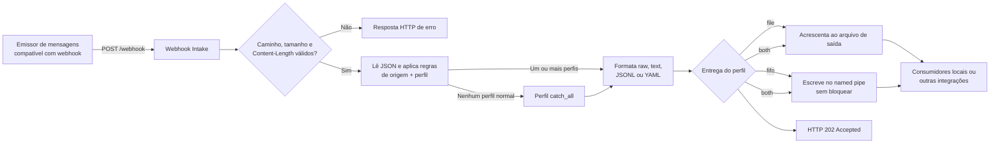

# Webhook Intake

[](https://github.com/wuilber002/webhook-intake/actions/workflows/tests.yml)

Read this document in [English](README.md).

Servidor HTTP leve para receber mensagens via webhook e gravá-las localmente. Ele não valida a origem criptograficamente; use-o atrás de uma rede ou proxy confiável (ou adicione autenticação no proxy) antes de expô-lo à internet.

## Aviso legal

Este material é disponibilizado no estado em que se encontra, sem garantias expressas ou implícitas, incluindo garantias de adequação a uma finalidade específica, disponibilidade, segurança, continuidade ou compatibilidade.

Não há compromisso de suporte, acordo de nível de serviço, manutenção ou evolução. O uso, modificação e redistribuição são de inteira responsabilidade e por conta e risco do usuário.

Antes de qualquer utilização, cabe ao usuário validar o comportamento, a segurança, a conformidade e a adequação operacional ao seu ambiente. Os autores e colaboradores não se responsabilizam por perdas, danos, interrupções de serviço, configurações incorretas ou impactos não intencionais decorrentes do uso deste material.

## Navegação

[English](README.md) · [Modelo de configuração do servidor](config.ini.example) · [Perfis](profile.d/) · [Perfil de exemplo](profile.d/profile.conf.example) · [Código do webhook](webhook.py) · [Testes](tests/) · [CI](.github/workflows/tests.yml) · [Licença](LICENSE)

## Requisitos e início

Python 3.11 ou superior. Não há dependências externas de Python. OpenSSL é necessário somente para gerar certificado TLS autoassinado. Crie uma configuração local antes de iniciar:

```bash
cp config.ini.example config.ini
python3 webhook.py --config config.ini
```

O endpoint é `POST /webhook` e a checagem é `GET /healthz`. O arquivo [config.ini.example](config.ini.example) fornecido escuta somente em `127.0.0.1:1604` e grava em `./output/`. Copie-o para `config.ini` e exponha outro endereço somente atrás de firewall ou proxy reverso confiável.

Para ver cada entrega no terminal (inclusive o perfil encontrado), use:

```bash
python3 webhook.py --config config.ini --debug
```

Também é possível sobrescrever host e porta: `--host 0.0.0.0 --port 1604`.

## HTTPS

HTTPS direto é opcional. Ative-o no `config.ini` local e informe um certificado e uma chave existentes:

```ini
tls_enabled = true
tls_cert_file = /etc/webhook-intake/fullchain.pem
tls_key_file = /etc/webhook-intake/privkey.pem
```

O servidor passa a escutar em `https://host:port/webhook` e exige TLS 1.2 ou superior. Mantenha os caminhos das chaves privadas fora do repositório.

Para desenvolvimento ou ambiente interno controlado, o script pode criar o próprio certificado na primeira inicialização:

```ini
tls_enabled = true
tls_self_signed = true
tls_cert_file = ./tls/webhook-intake.crt
tls_key_file = ./tls/webhook-intake.key
tls_self_signed_common_name = localhost
tls_self_signed_days = 365
```

Certificados autoassinados exigem [OpenSSL](https://www.openssl.org/) e não são confiados por clientes por padrão. Para um teste local, use `curl -k https://127.0.0.1:1604/webhook ...`; não use `-k` em produção. Para serviços públicos, use certificado emitido por uma autoridade confiável ou termine o TLS em proxy reverso confiável.

### Certificado de IP público com Certbot

Se um emissor exigir certificado publicamente confiável, mas conectar em um endereço IP público em vez de hostname, use o modo especial do Certbot. Ele exige Certbot 5.4 ou superior, IP estático globalmente roteável e TCP/80 de entrada disponível enquanto o Certbot realiza a validação ACME standalone:

```bash
sudo python3 webhook.py --config config.ini --certbot-mode \
  --certbot-ip 198.51.100.10 \
  --certbot-email admin@example.com
```

O script explica a operação e pede confirmação antes de contatar a autoridade certificadora. Em caso de sucesso, copia certificado e chave privada para `./tls/`, configura o `config.ini` para habilitar HTTPS e encerra sem iniciar o webhook. Use `--certbot-staging` para um teste inicial; o certificado emitido nesse modo não é publicamente confiável. `--certbot-yes` está disponível somente para uma execução não interativa deliberada.

Certificados de IP têm curta duração. Configure a renovação do Certbot e reinicie o webhook após a renovação para que ele carregue o certificado substituto. O diretório `tls/` gerado é ignorado pelo Git.

## Uso local

Na raiz do repositório, inicie o receptor com saída de depuração:

```bash
python3 webhook.py --config config.ini --debug
```

Em outro terminal, envie uma mensagem de teste:

```bash
curl -i http://127.0.0.1:1604/webhook \
  -H 'Content-Type: application/json' \
  -d '{"title":"Teste local","severity":"CRITICAL","body":"olá"}'
```

Com `tls_enabled = true`, use `https://` no lugar de `http://`. Adicione `-k` somente ao testar certificado autoassinado.

O perfil correspondente grava no diretório `output/` por padrão. Pare o receptor com `Ctrl+C`.

## Fluxo esperado da mensagem



Em um perfil FIFO com `fifo_on_unavailable = fail`, uma falha de entrega obrigatória no pipe retorna HTTP 503 em vez de HTTP 202, permitindo nova tentativa por emissores que suportam retry.

## Perfis

Os perfis são avaliados na ordem do arquivo. Todas as regras de `match` de um perfil precisam corresponder. Uma mesma mensagem pode ir para mais de um arquivo; acrescente `stop_after_match = true` ao perfil caso queira parar após ele. Um perfil com `catch_all = true` só recebe mensagens que não casaram com nenhum perfil normal.

Uma regra tem uma chave de campo em notação pontuada e um valor. O valor pode ser uma string (igualdade) ou uma tabela com `equals`, `contains` ou `regex`. Use `catch_all = true` para o perfil de fallback. Para mensagens cujo `body` contém JSON em texto, caminhos como `body.metadata.severity` também funcionam.

Cada perfil possui:

- `file`: caminho relativo ao diretório `output_dir` (ou absoluto). Se `output_dir` não existir, ele é criado; se não for configurado, usa `./output` ao lado do arquivo de configuração;
- `format`: `raw`, `text`, `jsonl` ou `yaml`;
- `text_template` (somente `text`): template Python com campos da mensagem, como `{title}` ou `{body}`. Campos inexistentes ficam vazios.

## Diretório `profile.d`

O `config.ini` contém somente a configuração do servidor e define `profile_dir = ./profile.d`. Na inicialização, todos os arquivos `*.conf` desse diretório são lidos em ordem alfabética. Arquivos sem uma seção `[profile:nome]`, com sintaxe inválida ou perfil sem `file` são ignorados e geram um aviso, sem parar o webhook. Perfis dentro do `config.ini` são rejeitados para evitar configuração espalhada.

Use [profile.d/profile.conf.example](profile.d/profile.conf.example) como referência: ele contém todos os parâmetros possíveis e valores `dummy`. Copie-o para um arquivo com extensão `.conf`, defina `enabled = true` e ajuste os valores para ativá-lo.

`raw` conserva o corpo recebido. `jsonl` grava um valor JSON compacto por linha e requer arquivo `.jsonl` ou `.ndjson`; documentos `.json` convencionais não são suportados intencionalmente. `yaml` produz YAML simples sem biblioteca adicional e requer arquivo `.yaml` ou `.yml`. Se o corpo não for JSON, os formatos estruturados registram `{received_at, content_type, raw}`. Como cada entrega é acrescentada ao final do arquivo, escolha um arquivo por mensagem/formato ou `raw`/`text` se precisar de um fluxo contínuo.

## Entrega por arquivo ou FIFO

Cada perfil pode escolher `delivery = file` (padrão), `fifo` ou `both`. Para `fifo` e `both`, informe `fifo_path`; o named pipe é criado automaticamente. A escrita usa modo não bloqueante, portanto a ausência de um consumidor nunca congela o endpoint HTTP.

Use `fifo_on_unavailable = warn` (padrão) para registrar o evento em modo debug e continuar, ou `fail` para devolver HTTP 503 e permitir que o remetente tente novamente. Mensagens maiores que o limite atômico do FIFO (`PIPE_BUF`) são recusadas, evitando entregas parciais. `both` é recomendado quando o arquivo também deve servir como histórico confiável.

## Rotação de arquivos

Perfis com entrega em arquivo podem rotacionar a saída por tamanho antes que uma nova entrega ultrapasse o limite configurado:

```ini
rotate_max_bytes = 10485760
rotate_keep = 10
rotation_mode = rename
```

`rotate_max_bytes` é medido em bytes; `0` desativa a rotação. `rotate_keep` define quantos arquivos arquivados serão mantidos. Os arquivos são arquivados ao lado do arquivo ativo, por exemplo `critical.20260703T143000Z.001.jsonl`.

Há dois modos de rotação:

- `rename` (recomendado): renomeia o arquivo ativo para um arquivo arquivado e cria um novo arquivo ativo na próxima escrita. Isso preserva o inode antigo para que consumidores corretos terminem sua leitura. Os consumidores devem acompanhar o nome do arquivo (`tail -F`) ou detectar a mudança de inode e reabrir o arquivo ativo.
- `copytruncate`: copia o arquivo ativo para um arquivo arquivado e, depois, trunca esse mesmo arquivo. Isso favorece consumidores legados que usam `tail -f` em um caminho fixo, mas um consumidor lento pode perder dados que ainda não tinha lido antes do truncamento. Não use quando o consumo exatamente uma vez for necessário.

A rotação ocorre sob o lock de escrita do webhook, portanto as próprias escritas do webhook não se misturam à rotação. Para consumidores que precisam de entrega imediata, use `delivery = both` e trate o JSONL rotacionado como histórico durável.

## Identificação por origem

Além das regras sobre o conteúdo da mensagem, cada perfil pode restringir a **origem de rede** recebida:

```ini
[profile:origem-confiavel]
file = messages.raw
format = raw
origin_cidr = 10.0.0.0/24
```

Use `origin` para um IP exato, `origin_cidr` para uma faixa CIDR, ou `origin_regex` para uma expressão regular. Todos os critérios do perfil precisam corresponder. A origem padrão é o IP que abriu a conexão TCP. Caso exista um proxy reverso confiável na frente do webhook, ative `trust_forwarded_for = true` para considerar o primeiro IP de `X-Forwarded-For`; não ative essa opção ao expor o serviço diretamente.

## Exemplo de envio

```bash
curl -i http://127.0.0.1:1604/webhook \
  -H 'Content-Type: application/json' \
  -d '{"title":"CPU alta","severity":"CRITICAL","body":"instância vm-01"}'
```

## Testes

O diretório `tests/` contém testes automatizados do carregamento de configurações, perfis, filtros de origem, escrita de arquivos e endpoint HTTP. Eles evitam regressões quando o webhook ou seus perfis forem alterados.

```bash
python3 -m unittest discover -s tests -v
```

Também é possível executar o arquivo de teste diretamente:

```bash
python3 tests/test_webhook.py
```

## GitHub

O repositório inclui `.gitignore` para não versionar mensagens recebidas, caches e ambientes locais, além de um workflow em `.github/workflows/tests.yml` que executa os testes em cada push e pull request.

## Licença

Este projeto é licenciado sob a [Apache License 2.0](LICENSE).
